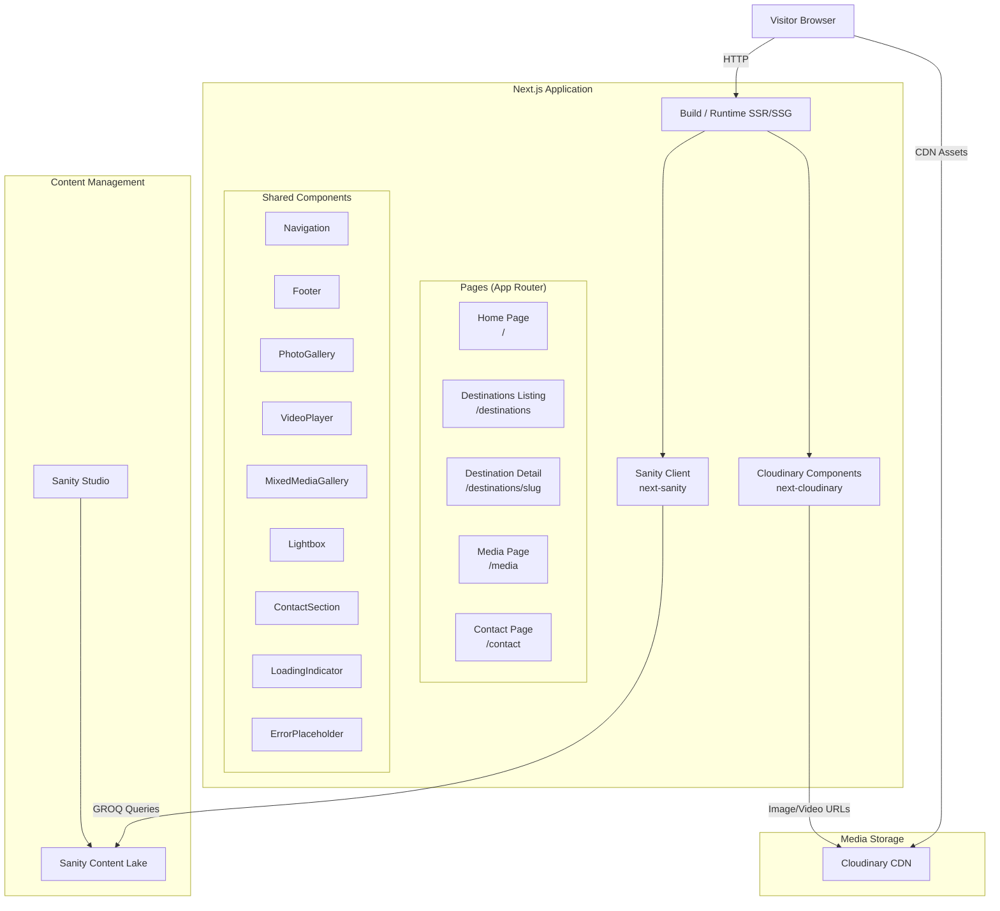

# Design Document: Tourist Website

## Overview

This design describes a tourist website built with Next.js (App Router) that showcases travel destinations with rich media. The system follows a headless CMS architecture where Sanity manages structured content and Cloudinary handles media storage, optimization, and delivery.

The website is server-rendered (SSG/SSR) for SEO, uses client-side navigation for smooth transitions, and delivers responsive, optimized media to all device sizes. Content editors manage destinations, media, and contact details in Sanity Studio; the Next.js frontend fetches this data via GROQ queries and resolves Cloudinary URLs for image/video delivery.

Key libraries:
- `next-sanity` — Sanity client with Next.js-specific helpers for GROQ queries and caching
- `next-cloudinary` — `CldImage` and `CldVideoPlayer` components for optimized media rendering
- `@sanity/image-url` — URL builder for Sanity image references (used alongside Cloudinary URLs)

## Architecture

### System Architecture Diagram



### Data Flow

1. At build time (SSG) or request time (SSR), Next.js server components call Sanity via GROQ queries using `next-sanity`.
2. Sanity returns structured JSON containing destination data, text content, and Cloudinary media references (public IDs or full URLs).
3. Next.js components pass Cloudinary public IDs to `CldImage` / `CldVideoPlayer` which construct optimized transformation URLs.
4. The visitor's browser loads the server-rendered HTML and fetches media assets directly from Cloudinary's CDN.
5. Client-side navigation (Next.js `<Link>`) handles page transitions without full reloads.

### Rendering Strategy

| Page | Strategy | Rationale |
|------|----------|-----------|
| Home (`/`) | ISR (revalidate: 60s) | Featured content changes occasionally |
| Destinations listing (`/destinations`) | ISR (revalidate: 60s) | New destinations added infrequently |
| Destination detail (`/destinations/[slug]`) | ISR (revalidate: 60s) + `generateStaticParams` | Pre-render known slugs, revalidate for updates |
| Media (`/media`) | ISR (revalidate: 60s) | Media gallery updates occasionally |
| Contact (`/contact`) | ISR (revalidate: 300s) | Contact info rarely changes |

## Components and Interfaces

### Page Components

#### `RootLayout` (`app/layout.tsx`)
- Renders `<Navigation />` and `<Footer />` persistently on every page
- Sets global metadata, fonts, and styles
- Wraps children in a main content area

#### `HomePage` (`app/page.tsx`)
- Server component that fetches hero banner, featured destinations (up to 6), and featured media (up to 6) from Sanity
- Renders hero section with `CldImage` for the banner + tagline
- Renders `DestinationCard` grid for featured destinations
- Renders `MixedMediaGallery` with featured media items

#### `DestinationsListingPage` (`app/destinations/page.tsx`)
- Server component that fetches all destinations from Sanity
- Renders a grid of `DestinationCard` components
- Each card links to `/destinations/[slug]`

#### `DestinationDetailPage` (`app/destinations/[slug]/page.tsx`)
- Server component that fetches a single destination by slug from Sanity
- Uses `generateMetadata` to set Open Graph tags (og:title, og:description, og:image, og:url)
- Renders destination name, full description, `MixedMediaGallery`, and `ContactSection` (if contact info available)
- Renders a back link to `/destinations`
- Returns `notFound()` if slug doesn't match any Sanity record

#### `MediaPage` (`app/media/page.tsx`)
- Server component that fetches all media items from Sanity
- Renders `MixedMediaGallery` with filter controls

#### `ContactPage` (`app/contact/page.tsx`)
- Server component that fetches contact details from Sanity
- Renders `ContactSection`

### Shared UI Components

#### `Navigation` (`components/Navigation.tsx`)
- Client component (needs state for mobile menu toggle)
- Links: Home, Destinations, Media, Contact
- Responsive: full horizontal nav ≥768px, collapsible hamburger menu <768px
- Uses Next.js `<Link>` for client-side routing

#### `Footer` (`components/Footer.tsx`)
- Server component
- Renders copyright info and secondary navigation links

#### `DestinationCard` (`components/DestinationCard.tsx`)
- Props: `name`, `slug`, `shortDescription`, `featuredImagePublicId`
- Renders a card with `CldImage` thumbnail, name, short description
- Wraps in `<Link href={/destinations/${slug}}>`

#### `MixedMediaGallery` (`components/MixedMediaGallery.tsx`)
- Client component (needs state for filter, lightbox, video player)
- Props: `items: MediaItem[]` (photos and videos interleaved per Sanity order)
- Renders a responsive grid: multi-column ≥768px, single-column <768px
- Filter controls: All | Photos Only | Videos Only
- Video thumbnails display a play icon overlay
- Each item has an accessible label with media type and title
- Photo click → opens `Lightbox`
- Video click → opens `VideoPlayer` inline or in modal

#### `PhotoGallery` (`components/PhotoGallery.tsx`)
- Can be used standalone or composed within `MixedMediaGallery`
- Props: `photos: PhotoItem[]`
- Renders grid of `CldImage` thumbnails with alt text from Sanity
- Uses Cloudinary responsive transformations (width, format: auto)
- Click → opens `Lightbox`

#### `Lightbox` (`components/Lightbox.tsx`)
- Client component
- Props: `photos: PhotoItem[]`, `currentIndex: number`, `onClose: () => void`
- Full-screen overlay displaying a large image via `CldImage` with appropriate size transformation
- Arrow controls for next/previous navigation
- Close on Escape key or close button click
- Caption display below image

#### `VideoPlayer` (`components/VideoPlayer.tsx`)
- Client component
- Props: `publicId: string`, `title: string`, `thumbnailPublicId?: string`
- Renders `CldVideoPlayer` from `next-cloudinary` with standard controls (play, pause, volume, fullscreen)
- No autoplay — playback starts only on user interaction
- Requests adaptive streaming from Cloudinary
- Shows error message if video fails to load

#### `ContactSection` (`components/ContactSection.tsx`)
- Props: `contact: ContactInfo`
- Renders phone as `<a href="tel:...">`, email as `<a href="mailto:...">`
- Renders physical address
- If geographic coordinates provided, renders an embedded map (iframe to OpenStreetMap or similar)
- Fallback message if contact data unavailable

#### `LoadingIndicator` (`components/LoadingIndicator.tsx`)
- Displayed via Next.js `loading.tsx` files while content is being fetched
- Simple spinner or skeleton UI

#### `ErrorPlaceholder` (`components/ErrorPlaceholder.tsx`)
- Props: `message: string`, `type: 'content' | 'media'`
- For content errors: "Content is temporarily unavailable" message
- For media errors: placeholder image with alt text

### Utility Modules

#### `lib/sanity/client.ts`
- Configures and exports the Sanity client using `next-sanity`
- Sets project ID, dataset, API version, and CDN usage

#### `lib/sanity/queries.ts`
- Exports all GROQ query strings as constants
- Examples:
  - `HOME_QUERY` — fetches hero, featured destinations, featured media
  - `DESTINATIONS_QUERY` — fetches all destinations with slug, name, image, description
  - `DESTINATION_BY_SLUG_QUERY` — fetches single destination with full media gallery
  - `ALL_MEDIA_QUERY` — fetches all media items ordered by display order
  - `CONTACT_QUERY` — fetches contact details

#### `lib/sanity/fetch.ts`
- Wrapper around `client.fetch()` with error handling
- Returns `{ data, error }` pattern for graceful degradation

#### `lib/cloudinary/utils.ts`
- Helper to construct Cloudinary URLs from public IDs if needed outside of `CldImage`
- Cloudinary cloud name configuration

#### `lib/utils/slug.ts`
- `generateSlug(name: string): string` — converts destination name to lowercase, hyphen-separated, URL-safe slug
- Strips diacritics, removes special characters, collapses whitespace to hyphens


## Data Models

### Sanity Schema Definitions

#### `destination` Document Type

```ts
// sanity/schemas/destination.ts
import { defineType, defineField } from 'sanity'

export default defineType({
  name: 'destination',
  title: 'Destination',
  type: 'document',
  fields: [
    defineField({
      name: 'name',
      title: 'Name',
      type: 'string',
      validation: (Rule) => Rule.required(),
    }),
    defineField({
      name: 'slug',
      title: 'Slug',
      type: 'slug',
      options: { source: 'name', maxLength: 96 },
      validation: (Rule) => Rule.required(),
    }),
    defineField({
      name: 'shortDescription',
      title: 'Short Description',
      type: 'text',
      rows: 3,
      validation: (Rule) => Rule.required().max(200),
    }),
    defineField({
      name: 'fullDescription',
      title: 'Full Description',
      type: 'text',
      validation: (Rule) => Rule.required(),
    }),
    defineField({
      name: 'featuredImage',
      title: 'Featured Image',
      type: 'cloudinaryMedia',
      validation: (Rule) => Rule.required(),
    }),
    defineField({
      name: 'gallery',
      title: 'Media Gallery',
      type: 'array',
      of: [{ type: 'mediaItem' }],
    }),
    defineField({
      name: 'contact',
      title: 'Contact Information',
      type: 'reference',
      to: [{ type: 'contactInfo' }],
    }),
    defineField({
      name: 'isFeatured',
      title: 'Featured on Home Page',
      type: 'boolean',
      initialValue: false,
    }),
    defineField({
      name: 'displayOrder',
      title: 'Display Order',
      type: 'number',
    }),
  ],
})
```

#### `mediaItem` Object Type

```ts
// sanity/schemas/mediaItem.ts
import { defineType, defineField } from 'sanity'

export default defineType({
  name: 'mediaItem',
  title: 'Media Item',
  type: 'object',
  fields: [
    defineField({
      name: 'mediaType',
      title: 'Media Type',
      type: 'string',
      options: {
        list: [
          { title: 'Photo', value: 'photo' },
          { title: 'Video', value: 'video' },
        ],
      },
      validation: (Rule) => Rule.required(),
    }),
    defineField({
      name: 'title',
      title: 'Title',
      type: 'string',
      validation: (Rule) => Rule.required(),
    }),
    defineField({
      name: 'altText',
      title: 'Alt Text',
      type: 'string',
      description: 'Accessibility description for the media',
    }),
    defineField({
      name: 'cloudinaryPublicId',
      title: 'Cloudinary Public ID',
      type: 'string',
      description: 'The public ID of the asset in Cloudinary',
      validation: (Rule) => Rule.required(),
    }),
    defineField({
      name: 'caption',
      title: 'Caption',
      type: 'string',
    }),
    defineField({
      name: 'displayOrder',
      title: 'Display Order',
      type: 'number',
    }),
  ],
})
```

#### `cloudinaryMedia` Object Type

```ts
// sanity/schemas/cloudinaryMedia.ts
import { defineType, defineField } from 'sanity'

export default defineType({
  name: 'cloudinaryMedia',
  title: 'Cloudinary Media',
  type: 'object',
  fields: [
    defineField({
      name: 'publicId',
      title: 'Cloudinary Public ID',
      type: 'string',
      validation: (Rule) => Rule.required(),
    }),
    defineField({
      name: 'altText',
      title: 'Alt Text',
      type: 'string',
    }),
    defineField({
      name: 'width',
      title: 'Width',
      type: 'number',
    }),
    defineField({
      name: 'height',
      title: 'Height',
      type: 'number',
    }),
  ],
})
```

#### `contactInfo` Document Type

```ts
// sanity/schemas/contactInfo.ts
import { defineType, defineField } from 'sanity'

export default defineType({
  name: 'contactInfo',
  title: 'Contact Information',
  type: 'document',
  fields: [
    defineField({
      name: 'label',
      title: 'Label',
      type: 'string',
      validation: (Rule) => Rule.required(),
    }),
    defineField({
      name: 'phone',
      title: 'Phone Number',
      type: 'string',
    }),
    defineField({
      name: 'email',
      title: 'Email Address',
      type: 'string',
      validation: (Rule) => Rule.email(),
    }),
    defineField({
      name: 'address',
      title: 'Physical Address',
      type: 'text',
      rows: 3,
    }),
    defineField({
      name: 'coordinates',
      title: 'Geographic Coordinates',
      type: 'geopoint',
    }),
  ],
})
```

#### `siteSettings` Singleton Document Type

```ts
// sanity/schemas/siteSettings.ts
import { defineType, defineField } from 'sanity'

export default defineType({
  name: 'siteSettings',
  title: 'Site Settings',
  type: 'document',
  fields: [
    defineField({
      name: 'siteName',
      title: 'Site Name',
      type: 'string',
    }),
    defineField({
      name: 'tagline',
      title: 'Tagline',
      type: 'string',
    }),
    defineField({
      name: 'heroBanner',
      title: 'Hero Banner Image',
      type: 'cloudinaryMedia',
    }),
    defineField({
      name: 'featuredMedia',
      title: 'Featured Media (Home Page)',
      type: 'array',
      of: [{ type: 'mediaItem' }],
      validation: (Rule) => Rule.max(6),
    }),
  ],
})
```

### TypeScript Interfaces (Frontend)

```ts
// types/index.ts

export interface CloudinaryMediaRef {
  publicId: string
  altText?: string
  width?: number
  height?: number
}

export interface MediaItem {
  _key: string
  mediaType: 'photo' | 'video'
  title: string
  altText?: string
  cloudinaryPublicId: string
  caption?: string
  displayOrder?: number
}

export interface Destination {
  _id: string
  name: string
  slug: { current: string }
  shortDescription: string
  fullDescription: string
  featuredImage: CloudinaryMediaRef
  gallery: MediaItem[]
  contact?: ContactInfo
  isFeatured: boolean
  displayOrder?: number
}

export interface ContactInfo {
  _id: string
  label: string
  phone?: string
  email?: string
  address?: string
  coordinates?: {
    lat: number
    lng: number
  }
}

export interface SiteSettings {
  siteName: string
  tagline: string
  heroBanner: CloudinaryMediaRef
  featuredMedia: MediaItem[]
}
```

### Key GROQ Queries

```groq
// Home page data
*[_type == "siteSettings"][0]{
  siteName,
  tagline,
  heroBanner,
  featuredMedia
}

// Featured destinations (up to 6)
*[_type == "destination" && isFeatured == true] | order(displayOrder asc) [0...6] {
  _id, name, slug, shortDescription, featuredImage
}

// All destinations
*[_type == "destination"] | order(displayOrder asc) {
  _id, name, slug, shortDescription, featuredImage
}

// Single destination by slug
*[_type == "destination" && slug.current == $slug][0]{
  _id, name, slug, shortDescription, fullDescription, featuredImage,
  gallery[] | order(displayOrder asc),
  contact->{ _id, label, phone, email, address, coordinates }
}

// All media items across destinations
*[_type == "destination" && defined(gallery)] {
  gallery[] | order(displayOrder asc) {
    _key, mediaType, title, altText, cloudinaryPublicId, caption, displayOrder
  }
}.gallery[]

// Contact info
*[_type == "contactInfo"][0]{
  _id, label, phone, email, address, coordinates
}
```


## Correctness Properties

*A property is a characteristic or behavior that should hold true across all valid executions of a system — essentially, a formal statement about what the system should do. Properties serve as the bridge between human-readable specifications and machine-verifiable correctness guarantees.*

### Property 1: Slug generation produces valid URL-safe strings

*For any* non-empty destination name string, `generateSlug(name)` SHALL produce a string that is:
- entirely lowercase
- composed only of characters matching `[a-z0-9-]`
- free of leading or trailing hyphens
- free of consecutive hyphens
- non-empty (at least one alphanumeric character)

**Validates: Requirements 7.2**

### Property 2: Open Graph meta tags reflect destination data

*For any* valid destination object (with name, shortDescription, featuredImage.publicId, and slug), the generated metadata SHALL produce Open Graph tags where:
- `og:title` equals the destination name
- `og:description` equals the destination's short description
- `og:image` contains the destination's Cloudinary public ID
- `og:url` ends with `/destinations/{slug.current}`

**Validates: Requirements 7.7**

### Property 3: Media type filter returns only matching items and preserves order

*For any* array of `MediaItem` objects (each with mediaType 'photo' or 'video') and *for any* filter selection ('all', 'photo', 'video'):
- When filter is 'all', the result SHALL equal the original array
- When filter is 'photo', every item in the result SHALL have `mediaType === 'photo'` and no photo from the original array SHALL be missing
- When filter is 'video', every item in the result SHALL have `mediaType === 'video'` and no video from the original array SHALL be missing
- In all cases, the relative order of items in the result SHALL match their relative order in the original array

**Validates: Requirements 9.5, 9.6**

### Property 4: Photo alt text propagation

*For any* array of photo items where each has an `altText` value from Sanity, the `PhotoGallery` component SHALL render each image with an `alt` attribute that exactly matches the corresponding `altText` value.

**Validates: Requirements 3.5**

### Property 5: Mixed media gallery accessible labels

*For any* `MediaItem` rendered in the `MixedMediaGallery`, the item's accessible label SHALL contain both the media type ('Photo' or 'Video') and the item's title.

**Validates: Requirements 9.8**

## Error Handling

### Content Fetching Errors (Sanity)

| Scenario | Handling | User Experience |
|----------|----------|-----------------|
| Sanity API unreachable | `lib/sanity/fetch.ts` catches error, returns `{ data: null, error }` | Page renders `ErrorPlaceholder` with "Content is temporarily unavailable" message |
| Sanity returns empty result for slug | `notFound()` called in page component | Next.js 404 page: "Destination not found" |
| Sanity returns malformed data | TypeScript type guards validate shape; fallback to error state | `ErrorPlaceholder` displayed |
| Sanity rate limit exceeded | Same as unreachable — caught by fetch wrapper | Same error message; ISR cache serves stale content if available |

### Media Loading Errors (Cloudinary)

| Scenario | Handling | User Experience |
|----------|----------|-----------------|
| Image fails to load | `CldImage` `onError` handler swaps to placeholder | Placeholder image with alt text shown; layout preserved |
| Video fails to load | `CldVideoPlayer` error event handler | "Video is currently unavailable" message in player area |
| Invalid Cloudinary public ID | Same as load failure | Placeholder or error message |

### Client-Side Errors

| Scenario | Handling | User Experience |
|----------|----------|-----------------|
| Lightbox navigation out of bounds | Index clamped to `[0, photos.length - 1]` | Arrow buttons disabled at boundaries or wrap around |
| Contact data missing fields | Conditional rendering — only show fields that exist | Partial contact info displayed; fallback message if all empty |
| Map embed fails | `iframe` `onError` handler hides map section | Address shown as text only |

### Error Boundary

A React Error Boundary wraps the main content area to catch unexpected rendering errors and display a fallback UI rather than a blank page.

## Testing Strategy

### Unit Tests (Example-Based)

Unit tests cover specific rendering, interactions, and edge cases:

- **Navigation**: Renders all 4 links; mobile menu toggles at <768px
- **Footer**: Renders copyright and secondary links
- **DestinationCard**: Renders name, image, description; links to correct slug URL
- **ContactSection**: Renders tel: link, mailto: link, address, map (when coordinates present), fallback message (when data missing)
- **Lightbox**: Opens on click, navigates next/previous, closes on Escape and close button
- **VideoPlayer**: Renders with controls, no autoplay, shows error on load failure
- **HomePage**: Renders hero banner, up to 6 featured cards, up to 6 media items
- **DestinationDetailPage**: Renders all sections, back link, 404 for unknown slug
- **Error handling**: Sanity unreachable → error message, Cloudinary failure → placeholder

### Property-Based Tests

Property-based tests verify universal correctness properties using [fast-check](https://github.com/dubzzz/fast-check) (JavaScript/TypeScript PBT library). Each test runs a minimum of 100 iterations.

| Property | Test Description | Tag |
|----------|-----------------|-----|
| Property 1 | Generate random strings, verify `generateSlug` output matches `^[a-z0-9]+(-[a-z0-9]+)*$` | `Feature: tourist-website, Property 1: Slug generation produces valid URL-safe strings` |
| Property 2 | Generate random destination objects, verify `generateMetadata` output contains correct OG fields | `Feature: tourist-website, Property 2: Open Graph meta tags reflect destination data` |
| Property 3 | Generate random `MediaItem[]` arrays and filter values, verify filter output correctness and order | `Feature: tourist-website, Property 3: Media type filter returns only matching items and preserves order` |
| Property 4 | Generate random photo arrays with alt text, render `PhotoGallery`, verify `alt` attributes match | `Feature: tourist-website, Property 4: Photo alt text propagation` |
| Property 5 | Generate random `MediaItem` objects, render in `MixedMediaGallery`, verify accessible labels contain type and title | `Feature: tourist-website, Property 5: Mixed media gallery accessible labels` |

### Integration Tests

- Sanity client fetches data correctly with mocked API responses
- Pages render with server-side data (SSR/SSG verification)
- Cloudinary components receive correct public IDs from Sanity data
- Navigation between pages works without full reload

### Smoke Tests

- All pages return 200 status (or expected status) when accessed directly
- SSR output contains meaningful HTML content (not empty body)
- Environment variables (Sanity project ID, Cloudinary cloud name) are configured

### Performance Tests

- Lighthouse CI: LCP ≤ 2.5s on simulated 4G for key pages
- Image optimization: verify WebP/AVIF format delivery via Cloudinary

